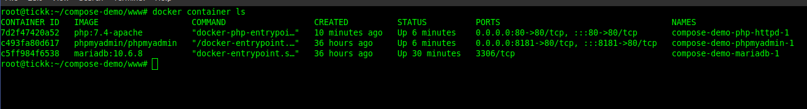
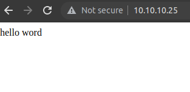
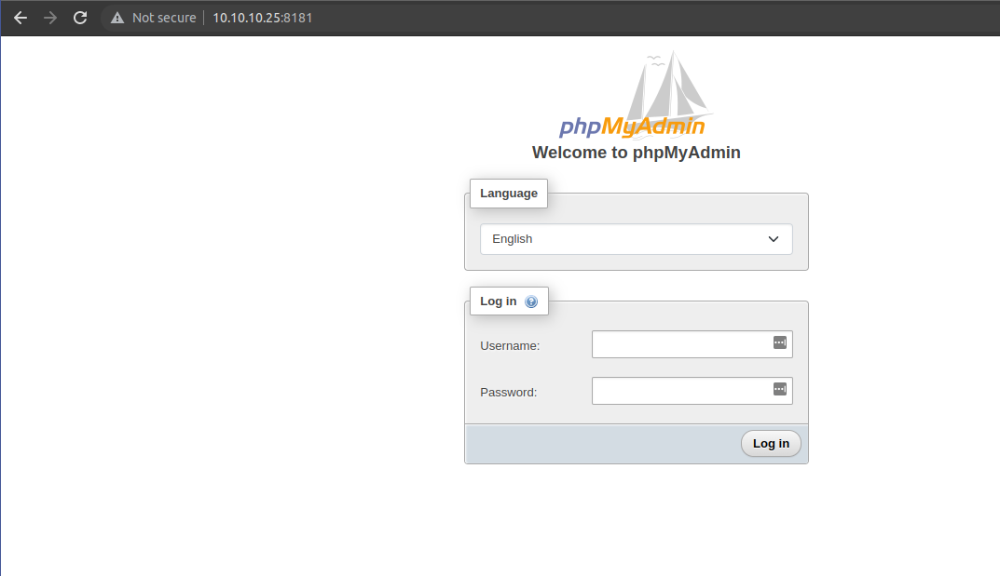

2. SSL monitoring :

Bisa pakai Uptime Kuma

docker volume create uptime-kuma

docker run -d --restart=always -p 3001:3001 -v uptime-kuma:/app/data --name uptime-kuma louislam/uptime-kuma:1

3. mysqldump -u database_username -p database_name > /home/cpanel_username/mysql-backup/(nama file).sql


Tugas: 


# TESTING

1. Untuk melakukan testing control machine maka directory docker compose lakukan test hosts

### Test dari control machine
```cli
docker container ls
```
```cli
docker compose up
```

```cli
docker rm {id container}
```
```cli
docker kill {id container}
```


# Hasil Container 


# Hasil Hello Word Nginx


# Hasil Hello Word APACHE   


# Hasil Hello Word APACHE   


